# Collaborative System

The Collaborative System is a full-stack web application for real-time teamwork. It combines project management, document editing, whiteboard collaboration, chat, and video calling into one workspace so users do not have to switch between separate tools.

## Architecture

The system is split into a frontend client, a Node.js and Express.js backend, a MySQL database, Socket.IO for real-time collaboration, WebRTC for video communication, and JWT-based authentication.

## Main Features

- User registration, login, OTP recovery, and password reset.
- Project creation, editing, invitations, and member management.
- Real-time collaborative document editing.
- Shared whiteboard with live drawing synchronization.
- Project chat with message history and unread notifications.
- Peer-to-peer video calling with camera and microphone controls.
- Project search and filtering.

## Benefits

- One unified platform for communication and collaboration.
- Less context switching between separate applications.
- Real-time updates across documents, whiteboards, chat, and calls.
- Secure access with JWT authentication and password hashing.
- Better productivity for students, developers, researchers, and teams.

## Future Ideas

- Role-based access control.
- Document history, comments, and suggestion mode.
- Expanded whiteboard tools such as shapes and sticky notes.
- File uploads, cloud storage, and mobile apps.
- AI-assisted writing and meeting summaries.
- Stronger security and third-party integrations.

## Related Documentation

- [Frontend README](collab-system-fe/README.md)
- [Backend README](collab-system-be/README.md)
- IT093IU_Group_2Quan_Project_Report
