# Backend README

## Overview

The backend is the core processing layer of the Collaborative System. It handles authentication, authorization, data persistence, business logic, and real-time collaboration services.

It is implemented with Node.js and Express.js using a modular structure for routes, controllers, middleware, models, and socket services. REST APIs handle standard CRUD operations, while Socket.IO and WebRTC handle live collaboration features.

## Architecture

The backend acts as the bridge between the frontend and MySQL, and also coordinates Socket.IO rooms for documents, whiteboards, chat, and video calls.

## Modules

- Authentication: registration, login, JWT authentication, bcrypt password hashing, OTP verification, and password reset.
- Project management: create, update, delete, invite members, leave projects, and member authorization.
- Document management: create, retrieve, update, delete, autosave, and real-time synchronization.
- Whiteboard management: create, load, save, and synchronize drawing events.
- Chat: load history, store messages, deliver notifications, and manage project rooms.
- Video calling: room management, peer discovery, SDP exchange, and ICE candidate exchange.
- Search: project search, keyword filtering, and debounced requests.

## Technologies

- Node.js for server-side execution.
- Express.js for routing and middleware.
- MySQL for persistent storage.
- Socket.IO for real-time collaboration.
- WebRTC signaling for peer-to-peer calls.
- JWT for protected endpoints.
- bcrypt for password hashing.
- Nodemailer for OTP and password recovery emails.

## Security and Database

- JWT authentication.
- Password hashing with bcrypt.
- Protected API endpoints.
- Input validation and parameterized queries.
- OTP verification and session handling.
- Access control for project members.

The MySQL database stores user accounts, projects, documents, whiteboards, chat messages, invitations, and password recovery data.

## Environment Variables

The backend expects these environment variables:

- `PORT`
- `DB_HOST`
- `DB_USER`
- `DB_PASS`
- `DB_NAME`
- `JWT_SECRET`
- `SESSION_SECRET`
- `EMAIL_USER`
- `EMAIL_PASS`

## Running the Backend

From `collab-system-be/`:

1. Install dependencies with `npm install`.
2. Set the environment variables above.
3. Start the server with `npm start`.

The server connects to MySQL and starts Socket.IO on the configured port.

## Future Improvements

- Role-based access control.
- Redis caching.
- Microservices for Socket.IO workloads.
- Horizontal scaling and rate limiting.
- Better logging, monitoring, Docker deployment, and Swagger docs.