# Frontend README

## Overview

The frontend is the presentation layer of the Collaborative System. It provides the browser-based interface for project management, document editing, whiteboard collaboration, chat, video calls, and account management.

It is built with HTML, CSS, and JavaScript and communicates with the backend through REST APIs, Socket.IO events, and WebRTC signaling. JWT tokens are used to keep authenticated sessions available in the browser.

## Architecture

The frontend is organized into modular pages and components so the UI, API layer, and real-time communication layer stay separated.

## Modules

- Authentication: register, login, forgot password, OTP verification, and password reset.
- Dashboard: project list, search, notifications, and invitations.
- Project management: create, edit, invite, remove members, and leave projects.
- Document editor: open, edit, autosave, and sync documents with Quill and Socket.IO.
- Whiteboard: collaborative drawing, brush and eraser tools, stroke sync, and autosave.
- Chat: message history, real-time delivery, and unread notifications.
- Video calling: camera access, microphone controls, and peer-to-peer communication.

## Technologies

- HTML5 for structure.
- CSS3 for responsive layouts and styling.
- JavaScript for client-side logic.
- Socket.IO client for real-time collaboration.
- WebRTC for video calls.
- Quill for rich text editing.
- Notyf for notifications.

## UI and UX Notes

- Responsive layouts for desktop screens.
- Dynamic updates without full page reloads.
- Clear navigation across all modules.
- Immediate visual feedback for collaborative actions.
- Simple interface for first-time users.

## Future Improvements

- Move to React or Vue.js.
- Add centralized state management.
- Improve mobile responsiveness and accessibility.
- Add dark mode and PWA features.
- Support offline editing and synchronization.

## Running the Frontend

This is a static frontend. Open `collab-system-fe/index.html` in a browser or serve the folder with a local static server or Live Server extension.